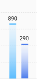
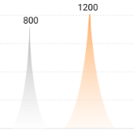
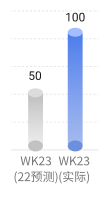
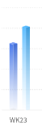

# 封装的一些图表组件的 echarts seriesData 配置

## 配置文件地址

`/@/src/views/dashboard/chartSeriesDataConfig`

### 特殊柱状 01

配置方法：`getMountainPeakDataDefaultParams` 参数说明：

- `color`: 颜色配置，默认蓝色
- `data`: 填充的数据
- `barWidth`: 柱子宽度
- `markPointColor`: 顶部标记区域颜色，默认蓝色
- `markPointHeight`: 顶部标记区域高度，默认 4
- `selfSeriesOption`: 覆盖默认配置

效果图 

### 山峰状

配置方法：`getMountainPeakDataDefaultParams` 参数说明：

- `colors`: 颜色配置，默认灰色和紫色
- `data`: 填充的数据

效果图 

### 圆柱

配置方法：`getCylinderSeriesData` 参数说明：

- `barWidth`: 柱子的宽度，默认 12

效果图 

### 方柱

配置方法：`getSquareCylindersData` 参数说明：

- `barWidth`: 柱子的宽度，默认 16
- `colors`: 颜色配置，默认紫色和蓝色
- `barNames`: 柱子名字，配置图例需要
- `dataList`: 填充的数据[[],[]], 多维数组，多个柱子需配置两个数据源

效果图 
